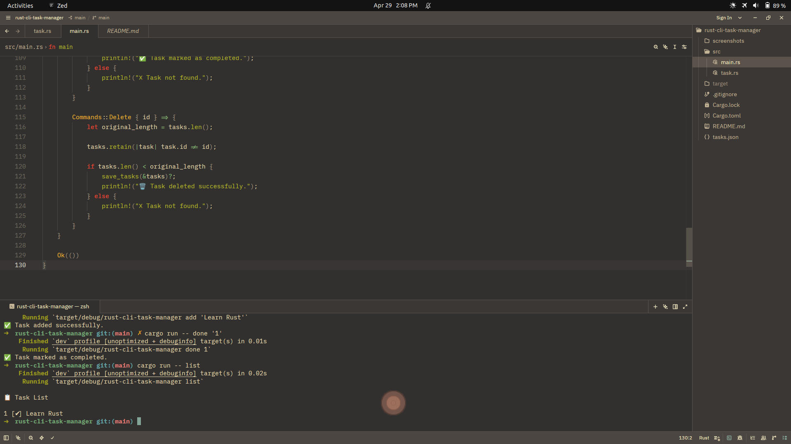

# README.md

# Rust CLI Task Manager 🦀

A simple command-line task manager built with Rust.

---

## Features

- Add tasks
- List tasks
- Mark tasks as completed
- Delete tasks
- Filter completed tasks
- Save tasks using JSON
- Task timestamps
- CLI argument parsing with clap

---

## Installation

Clone the repository:

git clone https://github.com/mokone-september/rust-cli-task-manager.git

Go into the project folder:

cd rust-cli-task-manager

Build the project:

cargo build

---

## Usage

Add a task:

cargo run -- add "Learn Rust"

List all tasks:

cargo run -- list

List only completed tasks:

cargo run -- list --completed

Mark a task as completed:

cargo run -- done 1

Delete a task:

cargo run -- delete 1

Show help:

cargo run -- --help

---

## Example Output

📋 Task List

1 [✔] Learn Rust (2026-04-26 10:15:22)
2 [✘] Build API (2026-04-26 10:20:10)

---

## Screenshot

---

## Concepts Learned

This project helped me learn:

- Structs
- Enums
- Pattern matching
- File I/O
- JSON persistence
- Serialization with serde
- CLI argument parsing
- Timestamps in Rust

---

## Tech Stack

- Rust
- chrono
- clap
- serde
- serde_json

---

## Future Improvements

- Better error handling
- SQLite database support
- Colored terminal output
- Task priorities
- Search functionality